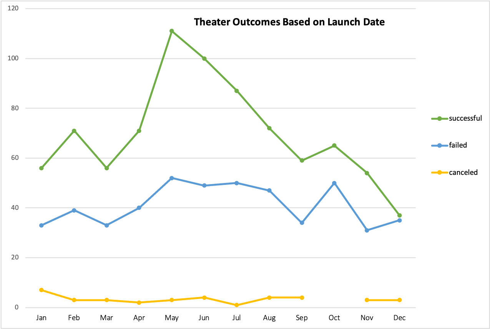
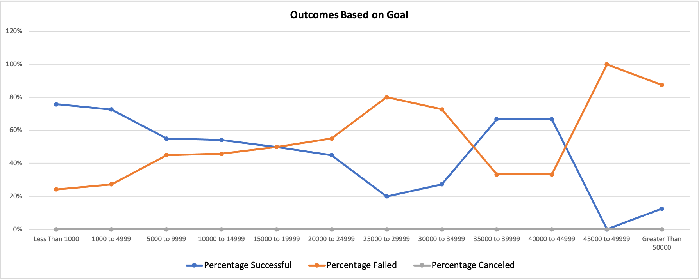

# Kickstarting with Excel

## Overview of Project

### Purpose

Playwright, Louise, used a fundraising campaign to try to obtain the money needed to produce her latest play, Fever. Fortunately for her, she got close to her fundraising goal in a short period of time. 

Louise wants to know how successful other campaigns raising money for a play or theater production were, based on their launch dates and fundraising goals. I analyzed the performance of other campaigns using data about them contained in [Kickstarter_Challenge]( Kickstarter_Challenge.xlsx.zip), and created visual representations of information that answer Louise’s question.

## Analysis and Challenges

### Analysis of Outcomes Based on Launch Date

To understand the relationship between launch date and if a campaign for a theater production met its fundraising goal, I created a line chart that displays the relationship of these two variables to one another. The line chart is titled “Theater Outcomes Based on Launch Date” and is shown at the bottom of this explanation.

How campaigns fared when it came to meeting their goal is grouped into three outcomes: Successful - the campaign met its fundraising goal, Failed - the campaign did not meet its fundraising goal, Canceled - the fundraising campaign was cancelled.

The number of campaigns that fall into each of these outcomes is shown on the y-axis of the chart.

The months of the year on which campaigns launched are shown on the x-axis of the chart.

How many campaigns for theater productions were either successful, failed or canceled relative to the month they launched is plotted in the line chart. This will allow us to tell at a glace if certain months of the year are better than others for launching a campaign for a theater production if you want it to meet its fundraising goal.

### Analysis of Outcomes Based on Goals

To show the relationship between the dollar amount of the fundraising goal and whether or not the goal was met, I created a line chart for campaigns for a play. The line chart is titled “Outcomes Based on Goal” and is shown at the bottom of this explanation.

How campaigns fared when it came to meeting their goal is grouped into three outcomes: Successful - the campaign met its fundraising goal, Failed - the campaign did not meet its fundraising goal, Canceled - the fundraising campaign was cancelled.

The percentage of campaigns that fall into each of these outcomes is shown on the y-axis of the chart.

Ranges of the dollar amounts of the campaigns’ fundraising goals are shown on the x-axis of the chart.

The percentage of campaigns for plays that were either successful, failed or canceled relative to the dollar amount of their fundraising goal is plotted in the line chart. This will allow us to tell at a glance if certain dollar amount ranges for fundraising goals are better than others if you want the campaign for a play it to meet its fundraising goal.

 

### Challenges and Difficulties Encountered

Getting information most relevant to Louise's question is very important to providing an accurate answer. The data analyzed for this project covered campaigns not just for theater productions and plays, but for those fundraising for many other purposes. I faced the challenge of removing from consideration the data for all campaigns NOT fundraising for plays or theater productions.

To surmount this challenge, I applied a filter to my pivot table used to generate the “Theater Outcomes Based on Launch Date” chart so only campaigns for a theater production were considered in the analysis.

Likewise, for my chart titled “Outcomes Based on Goal” I used the COUNTIFS() function to filter out from consideration any data not related to fundraising campaigns for plays.

## Results

- Two conclusions can be drawn from the “Theater Outcomes Based on Launch Date” chart. The first, is that the greatest number of successful campaigns launch between May and June. I recommend kicking off a campaign for a theater production during that window if you want to meet your fundraising goal. The second conclusion, is that the number of failed campaigns peaks in October, right around the time that there is also a dip in the number of successful campaigns. I would avoid launching a campaign during this month, as the analysis suggests that it will likely not meet its fundraising goal.

- The “Outcomes Based on Goal” chart reveals that the greatest percentage of successful campaigns for plays have fundraising goals in the dollar amount ranges of ($1,000 to $4,999), ($35,000 to $39,999) and ($40,000 to $44,999). I would set my fundraising goal to one of these ranges to have the best chance of meeting that goal.

- Limitations of dataset: while the data set we analyzed to answer Louise’s question told us a lot, it did not account for how well connected the campaign’s managers were to wealthy benefactors. If the manager had a business or social network that included rich contacts willing to support the campaign as a favor, that campaign would likely have a better chance of succeeding regardless of its goal or launch date.

- Other possible tables and/or graphs could be created. another variable that can impact a campaign’s outcome is geography. Where a campaign is held could affect whether it meets its fundraising goal. A chart that shows a relationship between country and outcomes would provide valuable insight. I would show the number of successful, failed or canceled campaigns on the y-axis, and the country where a campaign is being held on the x-axis.
